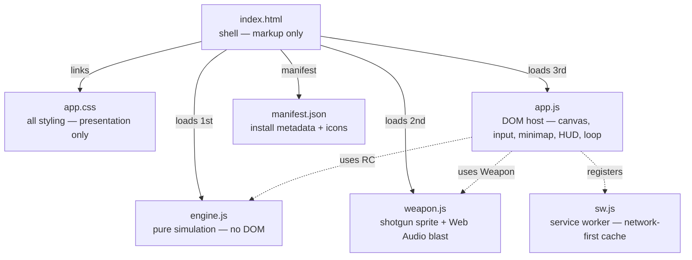
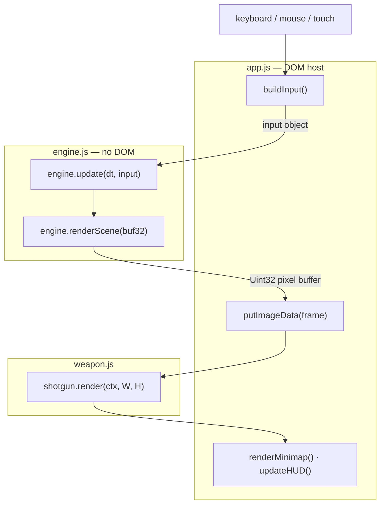

# RayCastle

> **Doomenstein** — a first-person maze to learn how Wolfenstein 3D's renderer worked.

A browser-based, first-person maze rendered with a **Wolfenstein 3D-style raycasting engine**, wrapped in a DOOM-flavoured techbase aesthetic: procedurally-textured walls, a live minimap, an amber status-bar HUD, a pump shotgun with synthesized sound, and full touch controls for phones.

Zero dependencies, zero build step — plain HTML, CSS, and vanilla JavaScript in a handful of files.

> **A note on the name.** This is a *raycaster* (one ray per screen column marched through a grid), which is the technology behind **Wolfenstein 3D**, not DOOM. DOOM used a BSP renderer. Because a maze is a grid of walls, the raycaster is exactly the right tool for it — see [Limitations](#limitations).

---

## For users

### Running it

Everything is static files. You have two options:

1. **Open directly** — double-click `index.html` (or open it via `file://`). This works because the scripts load with plain `<script>` tags rather than ES modules.
2. **Serve it** — from the project folder run any static server, e.g. `python3 -m http.server`, then visit the printed URL. Serving over `http://localhost` (or any `https://` host) is what enables the **PWA**: the service worker registers, the app becomes installable, and it works offline. See [Progressive Web App](#progressive-web-app).

Either way, **all the project files must sit in the same folder** (`index.html` references `app.css`, the scripts, the manifest, and the icons by relative path).

Click **ENTER THE MAZE** to start. On desktop the game grabs your mouse for looking; press **Esc** to release it and pause.

> The shotgun's sound is synthesized on the fly with the Web Audio API. Browsers require a user gesture before audio can play, so the very first shot is what "unlocks" it — expect sound from the first trigger pull onward.

### Controls — desktop

| Input | Action |
|-------|--------|
| `W` / `S` | Move forward / back |
| `A` / `D` | Strafe left / right |
| `↑` / `↓` | Move forward / back |
| `←` / `→` | Turn left / right |
| Mouse | Turn / look (after click-to-lock) |
| Scroll wheel | Move forward / back |
| `Shift` | Run |
| `Space` | Fire shotgun |
| `Esc` | Pause / release mouse |

### Controls — mobile (iPhone / touch)

On touch devices a control pane appears at the bottom of the screen:

- **Inverted-T D-pad** — ▲ forward, ▼ back, ◀ / ▶ turn.
- **FIRE** — shoots the shotgun.
- **⇄ swap** — flips the D-pad and FIRE sides for left- vs right-handed play.

Multi-touch works, so you can hold ▲ to walk while turning or firing. The pane is shown only on touch devices (via a `pointer: coarse` media query) and respects the iPhone's safe-area/home-indicator.

### Progressive Web App

RayCastle is installable and works offline. When it's served over `https://` or `http://localhost` (not `file://`), a service worker registers automatically.

- **Install** — on desktop Chrome/Edge, use the install icon in the address bar. On iPhone, open in Safari and tap **Share → Add to Home Screen**; it launches full-screen with its own icon, no browser chrome.
- **Offline** — after the first visit the app shell is cached, so it loads and plays with no network.
- **Updates** — the worker is **network-first**, so a fresh build is fetched whenever you're online and only falls back to the cache when offline. To force a clean shell after changing files, bump the `CACHE` version string in `sw.js`.

---

## For developers

### Project structure



Plus an `icons/` folder (`android-chrome-192x192`, `android-chrome-512x512`, `apple-touch-icon`, `favicon-16x16`, `favicon-32x32`, `favicon.ico`) referenced by the manifest and `<head>`.

`raycaster.html` is the original single-file prototype and is now superseded by the five files above — safe to delete.

### Architecture

The design goal is a **clean seam between simulation and presentation.**

- **`engine.js` is DOM-free.** It never looks up an element or attaches a listener. It exposes a global namespace `RC` and talks to the host through exactly three things: an abstract input object, a pixel buffer it draws into, and read-only getters. This is what lets the same engine be driven by a keyboard, a mouse, or an on-screen D-pad without knowing the difference. (The one concession: it creates offscreen `<canvas>` elements to bake textures — used purely as pixel buffers, never inserted into the page.)
- **`weapon.js` is a self-contained feedback module.** It owns the gun's animation state and its sound, and draws into the same low-res buffer as the walls so it upscales with matching pixels.
- **`app.js` owns everything browser-shaped:** canvases, resize, keyboard/mouse/touch capture, pointer lock, the minimap, the HUD, and the `requestAnimationFrame` loop that ties it together.

Modules are plain `<script>` tags sharing globals (`RC`, `Weapon`) rather than ES modules — deliberately, so the app runs from `file://` without a server (ES-module imports are blocked by CORS under `file://`). **Load order matters:** `engine.js` → `weapon.js` → `app.js`.



### How the renderer works

For each screen column, one ray is marched through the grid with the **DDA algorithm** (Lode Vandevenne's formulation) until it lands in a wall cell. A few details worth knowing before you extend it:

- **Perpendicular distance**, not ray length, sets wall height (`screenHeight / perpDist`). Using raw ray length would produce fisheye distortion at the screen edges.
- Walls are **texture-mapped** by reading each 64×64 procedural texture into a flat `Uint32Array` once, then sampling a column per ray and writing straight into a packed `Uint32` view of the frame — far faster than per-pixel `fillRect`.
- The scene renders into a small internal buffer (fixed **300px tall**, width follows the aspect ratio) and is CSS-upscaled with `image-rendering: pixelated`. This both boosts performance and gives the authentic chunky look.
- Distance **fog** and a slight darkening of east/west walls keep depth and corners readable.
- `zbuf[]` (per-column wall depth) is populated by the wall pass every frame and then consumed by the sprite pass — see below.

### Sprites & enemies

After the walls are drawn, `renderSprites()` draws each entity as a **billboard** — a screen-aligned quad that always faces the camera. The technique:

1. Transform the entity's world position into camera space by multiplying by the inverse of the camera matrix `[planeX dirX; planeY dirY]`. The resulting `transformY` is depth into the screen; `transformX` gives the horizontal offset.
2. Screen height is `RH / transformY` — the same inverse-distance rule the walls use, so sprites and walls share one consistent perspective.
3. **Depth test per column:** skip any column where `transformY >= zbuf[x]`, i.e. a wall is nearer. This is what makes an imp correctly disappear behind a corner.
4. Sprites are sorted **far → near** (painter's order) so overlapping enemies stack correctly, and each texel's alpha is tested so the transparent surround doesn't blot out the scene.

Enemies are procedurally-drawn imps with four frames (alive / hit / falling / corpse) and a small state machine: `idle → chase` once the player is within 12 cells **and** has line of sight (a walls-only `castRay`), `hit` on a flinch, then `dying → dead`, after which the corpse lies flat on the floor and can't be shot again. The shotgun's 7 pellets each call `castRay(..., hitEntities=true)`, which returns whichever is nearer — wall or imp — so pellets land as sparks on stone and blood on flesh. Three hits kill.

### Engine API (`RC`)

```js
RC.MAP            // 2D array; 0 = floor, 1..5 = wall texture id
RC.MAP_W, RC.MAP_H
RC.TILE_COLORS    // minimap colour per tile id
RC.createEngine() // → engine instance
```

An engine instance exposes:

```js
engine.player                 // { posX, posY, dirX, dirY, planeX, planeY }
engine.setResolution(w, h)    // set internal render size (allocates zbuf)
engine.update(dt, input)      // apply movement/turn/dolly from an input object
engine.renderScene(buf32)     // raycast into a Uint32 pixel buffer
engine.facingDegrees()        // compass heading, 0° = north
engine.RW, engine.RH          // current render dimensions (read-only)
engine.castRay(ox,oy,dx,dy,max,hitEntities) // hitscan → { hit, dist, x, y, mapX, mapY, side, tile } or { …, entity }
engine.entities               // live entity list: { x, y, hp, state, t }
engine.damage(entity, amount) // apply damage → true if this killed it
engine.zbuf                   // per-column depth (read-only; for sprites)
```

The **input object** passed to `update()` is fully abstract — the host builds it from whatever controls it likes:

```js
{ forward, back, strafeLeft, strafeRight,   // booleans
  turnLeft, turnRight, run,                 // booleans
  mouseDX,                                  // signed pixels of mouse turn
  dolly }                                   // signed distance impulse (wheel)
```

### Weapon API (`Weapon`)

```js
const shotgun = Weapon.createShotgun();
shotgun.fire();                 // trigger a shot (respects cooldown); plays sound
shotgun.update(dt, moving);     // advance recoil / flash / walk-bob
shotgun.render(ctx, W, H);      // draw the view-model over the scene
```

### Tuning reference

| Constant | File | Default | Controls |
|----------|------|---------|----------|
| `player.planeX` | engine.js | `0.66` | Field of view (≈66°) |
| move speed | engine.js | `3.0` | Walk speed (× `1.8` with Shift) |
| turn speed | engine.js | `2.4` | Turn rate |
| `BUF` | engine.js | `0.18` | Wall collision buffer |
| `DOLLY_STEP` | engine.js | `0.2` | Wheel-move anti-tunnel sub-step |
| `RH` | app.js | `300` | Internal render height (quality/perf) |
| `DOLLY_SENS` | app.js | `0.004` | Distance per pixel of scroll |
| mouse sensitivity | app.js | `0.0026` | Mouse-look turn rate |
| `FIRE_TIME` | weapon.js | `0.42` | Recoil animation length (s) |
| `COOLDOWN` | weapon.js | `0.55` | Minimum time between shots (s) |
| `GUN` | weapon.js | `0.25` | Overall view-model scale |
| `HALF_NEAR` / `GUN_H` | weapon.js | `95` / `160` | Gun base width / height (pre-scale) |

### Extending it

- **Change the maze** — edit `MAP` in engine.js (24×24; `0` = floor, `1`–`5` = wall textures). A boot-time `console.warn` fires if the spawn lands inside a wall.
- **Add a wall texture** — call `makeTexture(id, (ctx, size) => { … })` with a new id and reference it in `MAP`; add a matching colour to `TILE_COLORS`.
- **Add a weapon** — follow the `weapon.js` module pattern (a `create…()` factory returning `fire`/`update`/`render`); wire an input in app.js.
- **Persist the handedness toggle** — the mobile swap is session-only here (localStorage is avoided so it runs in sandboxed previews). In a deployed build, read/write `localStorage.getItem('handed')` on boot and in the toggle handler.

### Limitations

This is a **grid raycaster**, so by design it cannot do what DOOM's BSP renderer did:

- no varying wall/ceiling heights, stairs, or lifts
- no non-orthogonal (angled) walls
- no textured floors/ceilings (they're flat gradient bands)
- no rooms stacked over rooms

Those require a BSP or portal renderer — a substantially different (and larger) engine. For a maze, the grid is the right, elegant choice.

### Roadmap ideas

- ~~**Sprite renderer** using the exposed `zbuf` (enemies, pickups).~~ ✓ done — depth-tested billboards; see [Sprites & enemies](#sprites--enemies).
- ~~**Hitscan** — a `castRay()` in the engine so the shotgun actually hits walls/entities.~~ ✓ done — `engine.castRay()`; the shotgun fires a 7-pellet spread that leaves distance-scaled sparks on the wall. Entity hits slot into the same function.
- ~~**Enemies** with simple AI down the corridors.~~ ✓ done — imps that chase on line of sight and die in 3 hits.
- ~~**PWA shell** — a manifest + service worker to make it installable and offline-capable.~~ ✓ done — see [Progressive Web App](#progressive-web-app).
- **Floor/ceiling texture-casting** for a more DOOM-authentic look (per-pixel; costs perf).

---

### Browser support

Modern evergreen browsers. On iOS Safari there's no Pointer Lock, so mouse-look is unavailable — the on-screen touch controls cover mobile instead. Touch uses Pointer Events with capture, so a key can't stick if a finger slides off a button.
